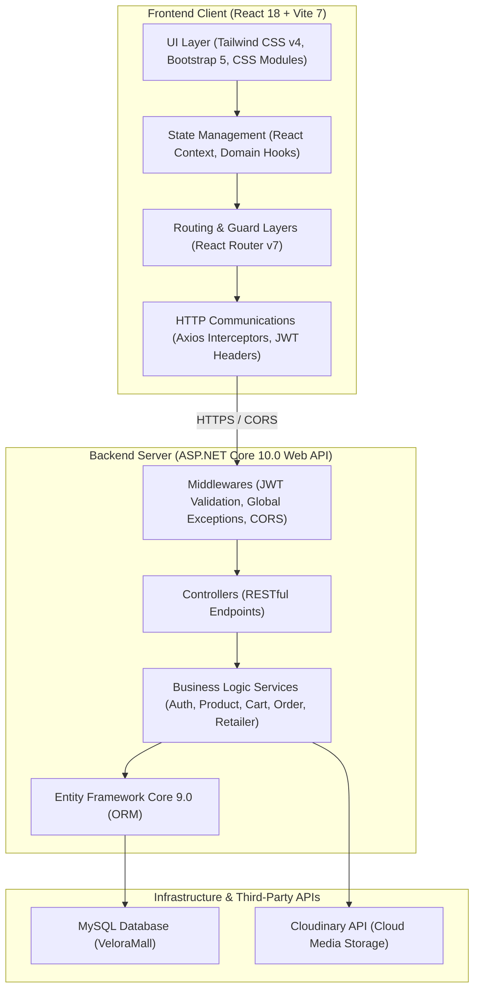

# 🛍️ VeloraMall - Multi-Tenant E-commerce Platform

Welcome to **VeloraMall**, a highly scalable, robust, and modern multi-tenant e-commerce platform. Built with a decoupled Client-Server architecture, this project ensures exceptional separation of concerns, high performance, and an outstanding developer experience. 

---

## 🌟 Project Analysis & Description

**VeloraMall** is designed to address the complexities of modern online retail marketplaces. Unlike standard single-store e-commerce systems, VeloraMall implements a **Multi-Tenant Architecture**, allowing multiple independent shops (run by **Retailers**) to operate concurrently on the same platform, while sharing a unified storefront and core administrative controls.

## Project Identification

* **Project Name**: E-Commerce Web Application
* **Project URL**: https://github.com/Binsadboiiz/e-commerce.git
* **Author**: Nguyen Phu Cuong, Nguyen Duong Ngoc Han

### User Roles & Interactions:
1. **Customers**: Can browse items across various categories and brands, search and apply complex multi-criteria filters, manage their shopping carts with specific product variations, check out seamlessly with Cash on Delivery (COD) or other payment methods, and monitor order delivery updates via a detailed tracking timeline.
2. **Retailers (Shop Owners)**: Own individual shops within the platform. They have access to a specialized Retailer Portal to manage shop details, define highly customized product specifications (variants like sizes, colors, and storage capacities), monitor dedicated inventory stock levels (available vs. reserved vs. sold), and process shop-specific orders.
3. **Administrators**: Maintain global oversight of the platform, including user accounts, shop approvals, taxonomic structures (brands, categories), and overall system health.

---

## 🏗️ System Architecture Overview

The system is decoupled into a high-performance **ASP.NET Core Web API** backend and a reactive **React Single Page Application (SPA)** frontend, communicating via secure RESTful APIs.



---

## 🛠️ Technology Stack

### 1. Backend (BE)
* **Core Framework:** `ASP.NET Core 10.0 Web API` (leveraging C# 13 productivity enhancements, nullable safety, and implicit global usings).
* **ORM & Database Access:** `Entity Framework Core 9.0` utilizing the `Pomelo.EntityFrameworkCore.MySql` database provider.
* **Security & Authentication:** Secure `JWT (JSON Web Tokens)` authentication paired with role-based policies (`Customer`, `Retailer`, `Admin`).
* **Cryptography:** `BCrypt.Net-Next` for cryptographically strong, salted password hashing.
* **Media & File Storage:** Fully integrated with `CloudinaryDotNet` SDK for efficient, cloud-hosted image uploads and management.
* **API Documentation:** Built-in `OpenAPI` integration for auto-generating interactive, explorer-ready API documentation.
* **Caching Layer:** Built-in `IMemoryCache` to minimize database query latency on high-frequency, low-mutability requests.
* **Error Resilience:** A custom global `ExceptionMiddleware` intercepts all runtime errors to guarantee a consistent JSON error format for the client.

### 2. Frontend (FE)
* **Library & Runtime:** `React 18` (Single Page Application paradigm).
* **Build Engine:** `Vite 7` for lightning-fast Hot Module Replacement (HMR) during development and highly compressed production asset builds.
* **Routing Engine:** `React Router DOM v7` configuring centralized route configurations and role-based guards (`ProtectedRoute`).
* **Styling Frameworks:**
  * `Tailwind CSS v4` coupled with the high-performance `@tailwindcss/vite` plugin.
  * `Bootstrap 5` for reliable, standard grid scaffolding.
  * `CSS Modules` (`*.module.css`) to enforce scoped, isolated styling for component boundaries.
* **Iconographies:** Sleek vector graphics powered by `Lucide React` & `React Icons`.
* **API Client:** Pre-configured `Axios` instances implementing token request interceptors and token-refresh hooks.
* **State Managers:** Integrated `React Context API` for session (`AuthContext`) and shopping cart (`CartContext`) state syncs.
* **User Notifications:** Dynamic, responsive alerts provided by `React Hot Toast`.

---

## 📂 Backend Architecture & Structure

The Backend is designed following the **Modular Service-Repository** pattern. Business domains are isolated into dedicated modules to avoid code coupling and keep the core execution pipeline clean and maintainable.

### Backend Folder Structure:
```text
BE/
├── Controllers/         # REST API Endpoints receiving client HTTPS Requests
│   ├── Auth/            # Authentication, registration, and user profiles
│   ├── Cart/            # Shopping cart adjustments & syncs
│   ├── Category/        # Taxonomy categories CRUD
│   ├── Checkout/        # Checkout calculations and placement
│   ├── Image/           # Cloudinary upload endpoints
│   ├── Order/           # Order tracking and consumer histories
│   ├── Product/         # Products, variants, attributes, and catalogs
│   └── Retailer/        # Merchant dashboard, shop settings, and operations
├── Models/              # Data structures layer
│   ├── Entities/        # EF Core Models representing the persistent domain objects
│   └── DTOs/            # Data Transfer Objects filtering ingress and egress data
├── Data/                # Data access infrastructure
│   ├── ApplicationDbContext.cs # Central EF Core DB configuration mapping entities and relations
│   └── Migrations/      # Auto-generated database migration scripts
├── Services/            # Core business logic layer
│   ├── Interface/       # Service contracts decoupling interfaces from implementations
│   └── Implementation/  # Concrete service classes executing the logic (AuthService, ProductService, etc.)
├── Extensions/          # System-level extensions
│   └── DependencyInjection/ # Modular DI Extension Methods (e.g. AuthDependencyInjection.cs) 
│                          # separating module registration logic to keep Program.cs clean.
├── Middlewares/         # Custom pipeline filters (e.g. ExceptionMiddleware)
├── Validators/          # Input schema and payload verification logic
├── Program.cs           # Main bootstrapping script configuring CORS, pipelines, and health logs
└── appsettings.json     # Configuration file containing connection strings and JWT secrets
```

### Architectural Benefits:
* **Decoupled Business Logic**: The controller merely handles input and outputs, delegating all computing and decision-making to the `Services` layer.
* **Clean Configuration**: By breaking dependency injection setups into individual extension classes inside `Extensions/DependencyInjection/`, the central [Program.cs](file:///d:/Information%20Technology/Personal-Project/e-commerce/BE/Program.cs) remains extremely clean and readable.

---

## 📂 Frontend Architecture & Structure

The Frontend uses a **Domain-Driven Feature-based Architecture**. Instead of arranging code by technical types (all components in one folder, all pages in another), files are grouped into cohesive, self-contained business domain modules.

### Frontend Folder Structure:
```text
FE/
├── public/              # Static public assets (favicon, site icons)
└── src/
    ├── assets/          # Global assets (images, stylesheets, fonts)
    ├── config/          # Centralized configuration schema
    │   └── route.config.js # Consolidated route paths (ROUTES object)
    ├── constants/       # Global constants, statuses, and standard values
    ├── context/         # Root-level React Context state managers (Auth, Theme)
    ├── styles/          # Root global styles and Tailwind variables
    ├── routes/          # Declarative React Router DOM setup (AppRoutes.jsx)
    ├── services/        # Configured core Axios client with middleware interceptors
    ├── hooks/           # Globally usable custom hooks
    ├── utils/           # Helper scripts (price formatters, date converters, storage wrappers)
    ├── components/      # Global, reusable UI components
    │   ├── layout/      # Core page templates (Header, Footer, Sidebar)
    │   ├── ProtectedRoute.jsx  # Role-restricted route guard component
    │   └── GlobalErrorHandler.jsx # Top-level error boundary capturing runtime UI exceptions
    │
    └── features/        # 🌟 CORE DOMAINS - Encapsulated Feature Modules
        ├── auth/        # Authentication, login, sign up, and account profile
        │   ├── api/     # Localized axios request functions
        │   ├── components/ # Local components (LoginForm, ProfileSettingsCard)
        │   ├── pages/   # Page routers (LoginPage, ProfilePage)
        │   └── hooks/   # Feature-specific hooks (useProfileActions)
        ├── product/     # Product grid, filter sidebar, and detail components
        ├── cart/        # Cart overlays, count widgets, and cart tables
        ├── checkout/    # Shipping form, payment choice, billing totals
        ├── order/       # Consumer order details and shipping tracking timeline
        ├── retailer/    # Retailer dashboard portal, store operations, product uploader
        └── home/        # Dashboard layout, landing carousels, and catalog grid
```

### Architectural Benefits:
* **High Modularity**: Each feature domain inside `features/` is isolated and context-independent. It keeps all pages, custom widgets, specific custom hooks, and specific API functions in one single place.
* **Scalable Codebase**: Developers can work simultaneously on separate domains (e.g., one on `features/cart/`, another on `features/retailer/`) without encountering git merge conflicts.
* **Ease of Maintenance**: Locating and fixing a bug within a page is fast and straightforward, as all its dependencies reside in the exact same directory.

---

## 🚀 Getting Started

### Prerequisites:
* **.NET SDK 10.0** installed.
* **Node.js (v18 or higher)** installed.
* **MySQL Server (v8.0 or higher)** installed.

### 1. Setup Database
1. Run MySQL and create a database named `VeloraMall`.
2. Import the schema file: [VeloraMall.sql](file:///d:/Information%20Technology/Personal-Project/e-commerce/database/schema/VeloraMall.sql).
3. Populate with dummy data: [seed_data.sql](file:///d:/Information%20Technology/Personal-Project/e-commerce/database/seed_data.sql).

### 2. Configure and Run Backend (BE)
1. Navigate to the `BE/` directory.
2. In `appsettings.json`, update the connection string to match your local MySQL configuration:
   ```json
   {
     "ConnectionStrings": {
       "DefaultConnection": "Server=localhost;Port=3306;Database=VeloraMall;User=root;Password=your_password;"
     }
   }
   ```
3. Run the following commands to restore dependencies and start the API:
   ```bash
   dotnet restore
   dotnet run
   ```
   *The API Server will be running at:* `https://localhost:5269`

### 3. Configure and Run Frontend (FE)
1. Navigate to the `FE/` directory.
2. Install client dependencies:
   ```bash
   npm install
   ```
3. Start the Vite development server:
   ```bash
   npm run dev
   ```
   *The Frontend application will be running at:* `http://localhost:5173`

---

> [!NOTE]
> This is a high-grade personal project developed to model actual production e-commerce platform scenarios. It follows strict modern engineering practices, clean code architectures, and premium developer-experience principles.
